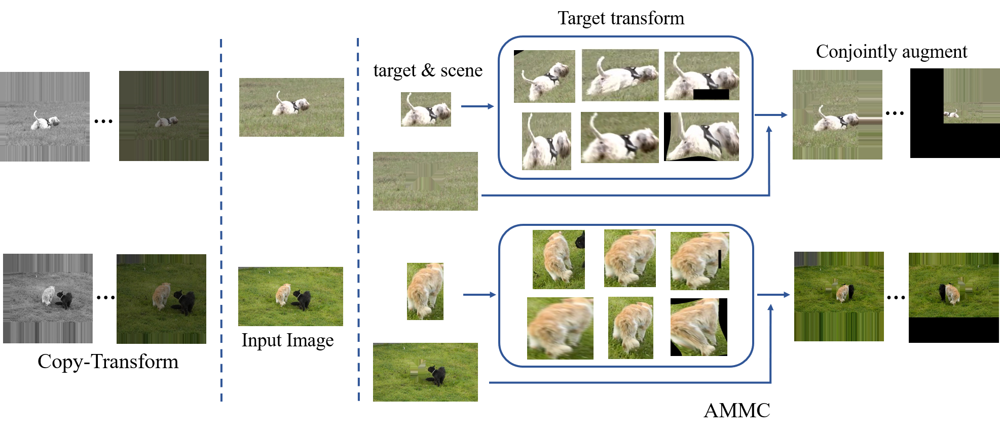

# AMMC(Augmentation by Mimicking Motion Change)
This is the official implementation of our **ACM MM 2021 oral** paper Do We Really Need Frame-by-Frame Annotation Datasets for Object Tracking?


# Setup AMMC
* Install AMMC
```bash
git clone https://github.com/wsumel/AMMC-Augmentation-by-Mimicking-Motion-Change-.git
cd  pytracking
```
&nbsp;&nbsp;&nbsp;&nbsp;&nbsp; Run the install script to install the dependencies.You need to provide the ${conda_install_path} (e.g. ~/anaconda3) and the name ${env_name} for the created conda environment (e.g. pytracking).
```bash
# install dependencies
bash install.sh ${conda_install_path} ${env_name}
conda activate pytracking
```
* Download AMMC Models

&nbsp;&nbsp;&nbsp;&nbsp;&nbsp;Pretrain model ATOM + AMMC and Dimp + AMMC can be download from [Baidu](https://pan.baidu.com/s/10GjAsYmK4HpW68bB4UEcvA) key:ammc
* Run tracker
```bash
conda activate pytracking
cd ./pytracking
# ATOM
python run_tracker.py atom default --dataset_name dataset_name --sequence sequence --debug debug --threads threads
# Dimp
python run_tracker.py dimp dimp50 --dataset_name dataset_name --sequence sequence --debug debug --threads threads
```

# How to reproduce our result  
* Download FAT(Few-annotation Tracking) benchmark
 
&nbsp;&nbsp;&nbsp;&nbsp;&nbsp;[Baidu](https://pan.baidu.com/s/1sYoS40Mg06uokzmRN2Usrg) key:ammc
* Training the tracker
```bash
conda activate pytracking
# ATOM + AMMC
python run_training.py bbreg atom_default
# Dimp + AMMC
python run_training.py dimp dimp50
```
# How to construct your own FAT benchmark
* Download three base datasets, namely [TrackingNet](https://tracking-net.org/), [GOT-10k](http://got-10k.aitestunion.com/), [LaSOT](https://cis.temple.edu/lasot/)

* Setting the inital size of the FAT: ```fat_frame_number``` on ```./ltr/admin/local.py```

* Run the script file and Modify the dataset path as your own 
```bash
cd ./ltr/
python extract_dataset.py
```

# Performance

* **LaSOT**
    | Tracker                                   | Success Score    | Precision Score  |  
    |:-----------                               |:----------------:|:----------------:|
    | ATOM (paper)                              | 0.515            | n/a              |
    | ATOM (ammc 1)                             | 0.476            | 0.465            |
    | ATOM (ammc 3)                             | 0.507            | 0.501            |
    | ATOM (ammc 5)                             | 0.510            | 0.505            |
    | ATOM (ammc 10)                            | 0.514            | 0.510            |
    | ATOM (ammc 1-10 best)                     | 0.514            | 0.510            |
    | ATOM (ammc paper)                         | 0.517            | n/a              |
    | DiMP50 (paper)                            | 0.569            | n/a              |
    | DiMP50 (ammc 1)                           | 0.524            | 0.502            |
    | DiMP50 (ammc 3)                           | 0.562            | 0.553            |
    | DiMP50 (ammc 5)                           | 0.571            | 0.567            |
    | DiMP50 (ammc 10)                          | 0.568            | 0.558            |
    | DiMP50 (ammc 1-10 best)                   | 0.571            | 0.567            |
    | DiMP50 (ammc paper)                       | 0.569            | n/a              |

* **GOT-10k:**
    | Tracker                                   | Success Score (AO) | SR(0.50)       | SR(0.75)         |  
    |:-----------                               |:----------------:|:----------------:|:----------------:|
    | ATOM (paper)                              | 0.556            | 0.634            | 0.402            |
    | ATOM (ammc 1)                             | 0.515            | 0.614            | 0.311            |
    | ATOM (ammc 3)                             | 0.553            | 0.645            | 0.408            |
    | ATOM (ammc 5))                            | 0.551            | 0.641            | 0.409            |
    | ATOM (ammc 10)                            | 0.549            | 0.636            | 0.408            |
    | ATOM (ammc 1-10 best)                     | 0.553            | 0.645            | 0.408            |
    | ATOM (ammc paper)                         | 0.564            | 0.661            | 0.411            |  
    | DiMP50 (paper)                            | 0.611            | 0.717            | 0.492            |
    | DiMP50 (ammc 1)                           | 0.525            | 0.626            | 0.323            |
    | DiMP50 (ammc 3)                           | 0.581            | 0.680            | 0.446            |
    | DiMP50 (ammc 5)                           | 0.605            | 0.708            | 0.488            |
    | DiMP50 (ammc 10)                          | 0.615            | 0.722            | 0.486            |
    | DiMP50 (ammc 1-10 best)                   | 0.615            | 0.722            | 0.486            |
    | DiMP50 (ammc paper)                       | 0.622            | 0.731            | 0.494            |


* **TrackingNet:**
    | Tracker                                   | Success Score    | Precision Score  |Normalized Precision Score  |  
    |:-----------                               |:----------------:|:----------------:|:----------------:|
    | ATOM (paper)                              | 0.703            | 0.648            | 0.771            |
    | ATOM (ammc 1)                             | 0.675            | 0.618            | 0.751            |
    | ATOM (ammc 3)                             | 0.712            | 0.650            | 0.770            |
    | ATOM (ammc 5)                             | 0.716            | 0.654            | 0.775            |
    | ATOM (ammc 10)                            | 0.713            | 0.650            | 0.768            |
    | ATOM (ammc 1-10 best)                     | 0.716            | 0.654            | 0.775            |
    | ATOM (ammc paper)                         | 0.712            | 0.648            | 0.769            |
    | DiMP50 (paper)                            | 0.740            | 0.687            | 0.801            |
    | DiMP50 (ammc 1)                           | 0.698            | 0.635            | 0.765            |
    | DiMP50 (ammc 3)                           | 0.740            | 0.682            | 0.795            |
    | DiMP50 (ammc 5)                           | 0.742            | 0.681            | 0.796            |
    | DiMP50 (ammc 10)                          | 0.747            | 0.685            | 0.797            |
    | DiMP50 (ammc 1-10 best)                   | 0.747            | 0.685            | 0.797            |
    | DiMP50 (ammc paper)                       | 0.746            | 0.687            | 0.797            |

* **OTB-100/OTB-2015:**
    | Tracker                                   | Success Score    | Precision Score  |  
    |:-----------                               |:----------------:|:----------------:|
    | ATOM (paper)                              | 0.669            | n/a              |
    | ATOM (ammc 1)                             | 0.662            | 0.885            |
    | ATOM (ammc 3)                             | 0.649            | 0.865            |
    | ATOM (ammc 5)                             | 0.638            | 0.858            |
    | ATOM (ammc 10)                            | 0.643            | 0.850            |
    | ATOM (ammc 1-10 best)                     | 0.662            | 0.885            |
    | ATOM (ammc paper)                         | 0.669            | n/a              |
    | DiMP50 (paper)                            | 0.684            | n/a              |
    | DiMP50 (ammc 1)                           | 0.652            | 0.862            |
    | DiMP50 (ammc 3)                           | 0.647            | 0.852            |
    | DiMP50 (ammc 5)                           | 0.643            | 0.850            |
    | DiMP50 (ammc 10)                          | 0.640            | 0.847            |
    | DiMP50 (ammc 1-10 best)                   | 0.652            | 0.862            |
    | DiMP50 (ammc paper)                       | 0.669            | n/a              |

* **UAV**
    | Tracker                                   | Success Score    | Precision Score  |  
    |:-----------                               |:----------------:|:----------------:|
    | ATOM (paper)                              | 0.644            | n/a              |
    | ATOM (ammc 1)                             | 0.622            | 0.850            |
    | ATOM (ammc 3)                             | 0.624            | 0.832            |
    | ATOM (ammc 5)                             | 0.607            | 0.816            |
    | ATOM (ammc 10)                            | 0.620            | 0.837            |
    | ATOM (ammc 1-10 best)                     | 0.624            | 0.832            |
    | ATOM (ammc paper)                         | 0.640            | n/a              |
    | DiMP50 (paper)                            | 0.654            | n/a              |
    | DiMP50 (ammc 1)                           | 0.628            | 0.844            |
    | DiMP50 (ammc 3)                           | 0.643            | 0.856            |
    | DiMP50 (ammc 5)                           | 0.619            | 0.820            |
    | DiMP50 (ammc 10)                          | 0.622            | 0.832            |
    | DiMP50 (ammc 1-10 best)                   | 0.643            | 0.856            |
    | DiMP50 (ammc paper)                       | 0.667            | n/a              |


  

# Acknowledgments
This repo is based on [Pytracking](https://github.com/visionml/pytracking.git) which is an excellent work

<!--
# Do We Really Need Frame-by-Frame Annotation Datasets for Object Tracking ?
paper
## Method Overview

<div align="center">
  
</div>

## Cite

## Setup
### Install Package Dependencies


## 数据集下载链接

**训练数据集：**

COCO：
http://images.cocodataset.org/zips/train2017.zip

http://images.cocodataset.org/zips/val2017.zip

http://images.cocodataset.org/annotations/annotations_trainval2017.zip

LaSOT：
https://drive.google.com/file/d/1O2DLxPP8M4Pn4-XCttCJUW3A29tDIeNa/view

GOT10k：
http://got-10k.aitestunion.com/downloads

TrackingNet：
https://drive.google.com/drive/u/0/folders/1gJOR-r-jPFFFCzKKlMOW80WFtuaMiaf6

**测试数据集下载链接：**

LaSOT：
https://drive.google.com/file/d/1O2DLxPP8M4Pn4-XCttCJUW3A29tDIeNa/view

GOT10k：
http://got-10k.aitestunion.com/downloads

TrackingNet：
https://drive.google.com/drive/u/0/folders/1gJOR-r-jPFFFCzKKlMOW80WFtuaMiaf6

OTB100：
http://cvlab.hanyang.ac.kr/tracker_benchmark/

UAV123：
https://cemse.kaust.edu.sa/ivul/uav123

**Installing & Training**

<a href='./pytracking-master/instruct.txt'>详细参考</a>

## 实验结果

* **OTB-100/OTB-2015:**
    | Tracker                                   | Success Score    | Precision Score  |  
    |:-----------                               |:----------------:|:----------------:|
    | ATOM (paper)                              | 0.669            | n/a              |
    | ATOM (local replication)                  | 0.664            | 0.870            |
    | ATOM (no coco all frame)                  | 0.648            | 0.853            |
    | ATOM no coco one frame                    | 0.645            | 0.869            |
    | ATOM no coco one frame target augmentation| 0.657            | 0.877            |
    | ATOM no coco one frame scence augmentation| 0.653            | 0.879            |
    | ATOM (no coco and one frame augmentation) | 0.664\0.666\0.658| 0.889\0.880\0.877  |
    | ATOM (no coco and one frame augmentation with coco) | 0.651  | 0.869            |
    | ATOM (no coco and three frame augmentation) | 0.660          | 0.869            |      
    | ATOM (no coco and five frame augmentation 3try ep80)| 0.655(0.622)  | 0.865(0.825) |
    | ATOM (no coco and ten frame augmentation) | 0.647            | 0.858            |
    | ATOM (no coco and all frame augmentation) | 0.645            | 0.850            |
    | DiMP50 (paper)                            | 0.684            | n/a              |
    | DiMP50 (local replication)                | 0.670            | 0.867            |
    | DiMP50 (no coco all frame)                | 0.667            | 0.867            |
    | DiMP50 (no coco and one frame augmentation)| 0.669\0.651\0.654 | 0.879\0.856\0.860 |
    | DiMP50 (no coco and three frame augmentation)| 0.640         | 0.837              |
    | DiMP50 (no coco and five frame augmentation)| 0.639          | 0.846            |
    | DiMP50 (no coco and ten frame augmentation)| 0.646          | 0.858            |
    | DiMP50 (no coco and all frame augmentation)| 0.659          | 0.861            |
    | ATOM only coco                           | 0.632            | n/a              |


    

[//]: <> ( ATOM First Augmentation |0.644|0.862)
[//]: <> (| ATOM only coco                          | 0.632            | n/a              |)
[//]: <> (| ATOM no coco one frame                  | 0.645            | 0.869            |)

* **UAV123:**
    | Tracker                                   | Success Score    | Precision Score  |  
    |:-----------                               |:----------------:|:----------------:|
    | ATOM (paper)                              | 0.644            | n/a              |
    | ATOM (local replication)                  | 0.629            | 0.835            |
    | ATOM (no coco all frame)                  | 0.629            | 0.839            |
    | ATOM (no coco and one frame augmentation) | 0.614\0.620\0.608| 0.853\0.842\0.832  |
    | ATOM (no coco and three frame augmentation) | 0.634          | 0.853            |
    | ATOM (no coco and five frame augmentation) | 0.613           | 0.828            |
    | ATOM (no coco and ten frame augmentation) | 0.611            | 0.826            |
    | ATOM (no coco and all frame augmentation) | 0.640            | 0.858            |
    | DiMP50 (paper)                            | 0.654            | n/a              |
    | DiMP50 (local replication)                | 0.646            | 0.854            |
    | DiMP50 (no coco all frame)                | 0.636            | 0.840            |
    | DiMP50 (no coco and one frame augmentation)| 0.607\0.626\0.623 | 0.812\0.837\0.838      |
    | DiMP50 (no coco and three frame augmentation ep80)| 0.614    | 0.816            |
    | DiMP50 (no coco and five frame augmentation)| 0.635          | 0.846            |
    | DiMP50 (no coco and ten frame augmentation )| 0.638          | 0.850            |
    | DiMP50 (no coco and all frame augmentation )| 0.667          | 0.883            |

 * **VOT2018:**  
    
     | Tracker                                    | EAO    | Accuracy (A) | Robustness (R) |  
     |:-----------                                |:----------------:|:----------------:|:----------------:|
     | ATOM (paper)                               | 0.401  |  0.590       |  0.204  |
     | ATOM (local)                               | 0.395  |  0.609       |  0.197  |
     | ATOM (no coco all frame)                   | 0.332  |  0.583       |  0.258  |
     | ATOM (no coco and one frame augmentation)  | 0.364\0.393\0.361  |  0.580\0.595\0.599       |  0.225\0.211\0.234  |
     | ATOM (no coco and three frame augmentation)| 0.371  |  0.568       |  0.225  |
     | ATOM (no coco and five frame augmentation) | 0.371  |  0.543       |  0.215  |
     | DiMP (paper)                               | 0.440  |  0.597       |  0.153  |
     | DiMP (local replication)                   | 0.471  |  0.604       |  0.136  |
     | DiMP (no coco all frame)                   | 0.371  |  0.583       |  0.234  |
     | DiMP (no coco and one frame augmentation)  | 0.364\0.370  |  0.607\0.598       |  0.229\0.225  |
     | DiMP (no coco and three frame augmentation)| 0.360  |  0.544       |  0.229  |
     | DiMP (no coco and three frame augmentation 0.1)| 0.358 | 0.546     |  0.215  |
     | DiMP (no coco and five frame augmentation) | 0.408  |  0.550       |  0.155  |
                                                                                                                                                                                                                                             


* **TrackingNet:**
    | Tracker                                   | Success Score    | Precision Score  |Normalized Precision Score  |  
    |:-----------                               |:----------------:|:----------------:|:----------------:|
    | ATOM (paper)                              | 0.703            | 0.648            | 0.771            |
    | ATOM (local replication)                  | 0.718            | 0.661            | 0.780            |
    | ATOM (no coco all frame)                  | 0.724            | 0.666            | 0.786            |
    | ATOM (no coco one frame)                  | 0.650            | 0.587            | 0.731            |
    | ATOM (no coco and one frame augmentation) | 0.673\0.675\0.675| 0.613\0.615\0.619| 0.746\0.747\0.751|
    | ATOM (no coco and three frame augmentation) | 0.705          | 0.640            | 0.764            |
    | ATOM (no coco and five frame augmentation) | 0.712           | 0.648            | 0.769            |
    | ATOM (no coco and ten frame augmentation) | 0.710            | 0.638            | 0.763            |
    | ATOM (no coco and all frame augmentation) | 0.719            | 0.659            | 0.776            |
    | DiMP50 (paper)                            | 0.740            | 0.687            | 0.801            |
    | DiMP50 (local replication)                | 0.741            | 0.683            | 0.797            |
    | DiMP50 (no coco and all frame)            | 0.749            | 0.692            | 0.807            |
    | DiMP50 (no coco and one frame augmentation) | 0.700\0.703\0.703| 0.640\0.641\0.640| 0.768\0.769\0.771|
    | DiMP50 (no coco and three frame augmentation) | 0.737        | 0.676            | 0.791            |
    | DiMP50 (no coco and five frame augmentation)| 0.742          | 0.679            | 0.794            |
    | DiMP50 (no coco and ten frame augmentation)| 0.747           | 0.687            | 0.798            |
    | DiMP50 (no coco and all frame augmentation)| 0.747           | 0.692            | 0.805            |

* **LaSOT:**
    | Tracker                                   | Success Score    | 
    |:-----------                               |:----------------:|
    | ATOM (paper)                              | 0.515            |
    | ATOM (local replication)                  | 0.518            |
    | ATOM (no coco all frame)                  | n/a              |
    | ATOM (no coco and one frame augmentation) | 0.492\0.479\0.483|
    | ATOM (no coco and three frame augmentation)| 0.508           |
    | ATOM (no coco and five frame augmentation)| 0.504            |
    | ATOM (no coco and ten frame augmentation) | 0.517            |
    | ATOM (no coco and all frame augmentation) | 0.519            |
    | DiMP50 (paper)                            | 0.569            |
    | DiMP50 (local replication)                | 0.559            |
    | DiMP50 (no coco and all frame)            | 0.578           |
    | DiMP50 (no coco and one frame augmentation)| 0.519\0.524\0.523|
    | DiMP50 (no coco and three frame augmentation)| 0.558         |
    | DiMP50 (no coco and five frame augmentation)| 0.569          |
    | DiMP50 (no coco and ten frame augmentation)| 0.568           |
    | DiMP50 (no coco and all frame augmentation)| 0.569           |


* **GOT-10k:**
    | Tracker                                   | Success Score (AO) | SR(0.50)       | SR(0.75)         |  
    |:-----------                               |:----------------:|:----------------:|:----------------:|
    | ATOM (paper)                              | 0.556            | 0.634            | 0.402            |
    | ATOM (local replication)                  | 0.562            | 0.650            | 0.426            |
    | ATOM (no coco all frame)                  | n/a              | n/a              | n/a              |
    | ATOM (no coco one frame)                  | 0.494            | 0.571            | 0.232            |
    | ATOM (no coco and one frame augmentation) | 0.516\0.502\0.509| 0.607\0.593\0.603| 0.309\0.294\0.302|
    | ATOM (no coco and three frame augmentation) | 0.564          | 0.661            | 0.411            |
    | ATOM (no coco and five frame augmentation) | 0.543           | 0.638            | 0.403            |
    | ATOM (no coco and ten frame augmentation) | 0.547            | 0.639            | 0.402            |
    | ATOM (no coco and all frame augmentation) | 0.560            | 0.649            | 0.417            |
    | ATOM(all aug)                             | 0.560            |0.649             | 0.417            |
    | DiMP50 (paper)                            | 0.611            | 0.717            | 0.492            |
    | DiMP50 (local replication)                | 0.598            | 0.707            | 0.468            |
    | DiMP50 (no coco all frame)                | n/a              | n/a              | n/a              |
    | DiMP50 (no coco and one frame augmentation)| 0.542\0.532\0.524| 0.650\0.641\929 | 0.334\0.321\0.321|
    | DiMP50 (no coco and three frame augmentation)| 0.591         | 0.693            | 0.460            |
    | DiMP50 (no coco and three frame augmentation 0.1 50)| 0.601  | 0.704            | 0.473            |
    | DiMP50 (no coco and five frame augmentation)| 0.605          | 0.713            | 0.473            |
    | DiMP50 (no coco and ten frame augmentation)| 0.622           | 0.731            | 0.494            |
    | DiMP50 (no coco and all frame augmnentation)| 0.613          | 0.727            | 0.484            |


* **Tracking dataset usage:**
<table style="font-size:9px;text-align:center;">
    <tr>
        <td>Algorithm</td>
        <td>LaSOT</td>
        <td>GOT-10K</td>
        <td>TrackingNet</td>
        <td>MSCOCOSeq</td>
        <td>ILSVRC-VID</td>
        <td>ILSVRC-DET</td>
        <td>YOUTUBEBB</td>
        <td>COCO</td>
        <td>OTB-100</td>
        <td>OTB2015</td>
        <td>VOT-18</td>
        <td>UAV123</td>
        <td>TempleColor</td>
        <td>VOT2018LT</td>
        <td>VOT2019LT</td>
        <td>OxUvALT</td>
        <td>TLP</td>
        <td>DAVIS2017</td>
        <td>NfS</td>
        <td>LTB35</td>
        <td>YouTube-VOS</td>
    </tr>
    <tr>
        <td><b>ATOM</b></td>
        <td>&#10003</td>
        <td>&#10003</td>
        <td>&#10003</td>
        <td>&#10003</td>
        <td></td>
        <td></td>
        <td></td>
        <td></td>
        <td></td>
        <td></td>
        <td></td>
        <td></td>
        <td></td>
        <td></td>
        <td></td>
        <td></td>
        <td></td>
        <td></td>
        <td></td>
        <td></td>
        <td></td>
    </tr>
    <tr>
        <td><b>DiMP50</b></td>
        <td>&#10003</td>
        <td>&#10003</td>
        <td>&#10003</td>
        <td>&#10003</td>
        <td></td>
        <td></td>
        <td></td>
        <td></td>
        <td></td>
        <td></td>
        <td></td>
        <td></td>
        <td></td>
        <td></td>
        <td></td>
        <td></td>
        <td></td>
        <td></td>
        <td></td>
        <td></td>
        <td></td>
    </tr>
    <tr>
        <td><b>PrDiMP18</b></td>
        <td>&#10003</td>
        <td>&#10003</td>
        <td>&#10003</td>
        <td>&#10003</td>
        <td></td>
        <td></td>
        <td></td>
        <td></td>
        <td></td>
        <td></td>
        <td></td>
        <td></td>
        <td></td>
        <td></td>
        <td></td>
        <td></td>
        <td></td>
        <td></td>
        <td></td>
        <td></td>
        <td></td>
    </tr>
    <tr>
        <td><b>PrDiMP50</b></td>
        <td>&#10003</td>
        <td>&#10003</td>
        <td>&#10003</td>
        <td>&#10003</td>
        <td></td>
        <td></td>
        <td></td>
        <td></td>
        <td></td>
        <td></td>
        <td></td>
        <td></td>
        <td></td>
        <td></td>
        <td></td>
        <td></td>
        <td></td>
        <td></td>
        <td></td>
        <td></td>
        <td></td>
    </tr>
    <tr>
        <td><b>SiamRPN</b></td>
        <td></td>
        <td></td>
        <td></td>
        <td></td>
        <td>&#10003</td>
        <td>&#10003</td>
        <td>&#10003</td>
        <td>&#10003</td>
        <td></td>
        <td></td>
        <td></td>
        <td></td>
        <td></td>
        <td></td>
        <td></td>
        <td></td>
        <td></td>
        <td></td>
        <td></td>
        <td></td>
        <td></td>
    </tr>
    <tr>
        <td><b>SiamRPN++</b></td>
        <td></td>
        <td></td>
        <td></td>
        <td></td>
        <td>&#10003</td>
        <td>&#10003</td>
        <td>&#10003</td>
        <td>&#10003</td>
        <td></td>
        <td></td>
        <td></td>
        <td></td>
        <td></td>
        <td></td>
        <td></td>
        <td></td>
        <td></td>
        <td></td>
        <td></td>
        <td></td>
        <td></td>
    </tr>
    <tr>
        <td><b>SiamBan</b></td>
        <td>&#10003</td>
        <td>&#10003</td>
        <td></td>
        <td></td>
        <td>&#10003</td>
        <td>&#10003</td>
        <td>&#10003</td>
        <td>&#10003</td>
        <td></td>
        <td></td>
        <td></td>
        <td></td>
        <td></td>
        <td></td>
        <td></td>
        <td></td>
        <td></td>
        <td></td>
        <td></td>
        <td></td>
        <td></td>
    </tr>
    <tr>
        <td><b>MAML-Tracker</b></td>
        <td>&#10003</td>
        <td></td>
        <td>&#10003</td>
        <td></td>
        <td></td>
        <td></td>
        <td></td>
        <td></td>
        <td>&#10003</td>
        <td>&#10003</td>
        <td></td>
        <td></td>
        <td></td>
        <td></td>
        <td></td>
        <td></td>
        <td></td>
        <td></td>
        <td></td>
        <td></td>
        <td></td>
    </tr>
    <tr>
        <td><b>RT-MDNet</b></td>
        <td></td>
        <td></td>
        <td></td>
        <td></td>
        <td></td>
        <td></td>
        <td></td>
        <td></td>
        <td></td>
        <td>&#10003</td>
        <td></td>
        <td>&#10003</td>
        <td>&#10003</td>
        <td></td>
        <td></td>
        <td></td>
        <td></td>
        <td></td>
        <td></td>
        <td></td>
        <td></td>
    </tr>
    <tr>
        <td><b>LTMU</b></td>
        <td>&#10003</td>
        <td></td>
        <td></td>
        <td></td>
        <td></td>
        <td></td>
        <td></td>
        <td></td>
        <td></td>
        <td></td>
        <td></td>
        <td></td>
        <td></td>
        <td>&#10003</td>
        <td>&#10003</td>
        <td>&#10003</td>
        <td>&#10003</td>
        <td></td>
        <td></td>
        <td></td>
        <td></td>
    </tr>
    <tr>
        <td><b>Siam R-CNN</b></td>
        <td>&#10003</td>
        <td>&#10003</td>
        <td>&#10003</td>
        <td></td>
        <td></td>
        <td></td>
        <td></td>
        <td></td>
        <td></td>
        <td>&#10003</td>
        <td>&#10003</td>
        <td>&#10003</td>
        <td></td>
        <td></td>
        <td></td>
        <td>&#10003</td>
        <td></td>
        <td>&#10003</td>
        <td>&#10003</td>
        <td>&#10003</td>
        <td>&#10003</td>
    </tr>
    <tr>
        <td><b>MAST</b></td>
        <td></td>
        <td></td>
        <td></td>
        <td></td>
        <td></td>
        <td></td>
        <td></td>
        <td></td>
        <td></td>
        <td></td>
        <td></td>
        <td></td>
        <td></td>
        <td></td>
        <td></td>
        <td></td>
        <td></td>
        <td>&#10003</td>
        <td></td>
        <td></td>
        <td>&#10003</td>
    </tr>
</table>


* **Tracking Dataset:**
<table style="font-size:11px;text-align:center;">
    <tr>
        <td rowspan="2">Dataset</td>
        <td colspan="3">Total</td>
        <td colspan="3">Train</td>
        <td colspan="3">Test</td>
        <td colspan="3">Properties</td>
    </tr>
    <tr>
        <td>Classes</td>
        <td>Videos</td>
        <td>Boxes</td>
        <td>Classes</td>
        <td>Videos</td>
        <td>Boxes</td>
        <td>Classes</td>
        <td>Videos</td>
        <td>Boxes</td>
        <td>Exp. Setting</td>
        <td>Min/Max/Avg.<br>Duration<br>(seconds)</td>
        <td>Frame Rate</td>
    </tr>
    <tr>
        <td><b>LaSOT</b></td>
        <td>70</td>
        <td>1.4K</td>
        <td>3.3M</td>
        <td>70</td>
        <td>1.1K</td>
        <td>2.8M</td>
        <td>70</td>
        <td>280</td>
        <td>685K</td>
        <td>fully overlapped</td>
        <td>33/380/84</td>
        <td>30fps</td>
    </tr>
    <tr>
        <td><b>GOT-10K</b></td>
        <td>563</td>
        <td>10K</td>
        <td>1.5M</td>
        <td>480</td>
        <td>9.34K</td>
        <td>1.4M</td>
        <td>84</td>
        <td>420</td>
        <td>56K</td>
        <td>one-shot</td>
        <td>0.4/148/15</td>
        <td>10fps</td>
    </tr>
    <tr>
        <td><b>TrackingNet</b></td>
        <td>21</td>
        <td>31K</td>
        <td>14M</td>
        <td>21</td>
        <td>30K</td>
        <td>14M</td>
        <td>21</td>
        <td>511</td>
        <td>226K</td>
        <td>fully overlapped</td>
        <td>-/-/16</td>
        <td>30fps</td>
    </tr>
    <tr>
        <td><b>ILSVRC-VID</b></td>
        <td>30</td>
        <td>5.4K</td>
        <td>2.7M</td>
        <td>30</td>
        <td>5.4K</td>
        <td>2.7M</td>
        <td>-</td>
        <td>-</td>
        <td>-</td>
        <td>-</td>
        <td>0.2/183/11</td>
        <td>30fps</td>
    </tr>
</table>
-->


